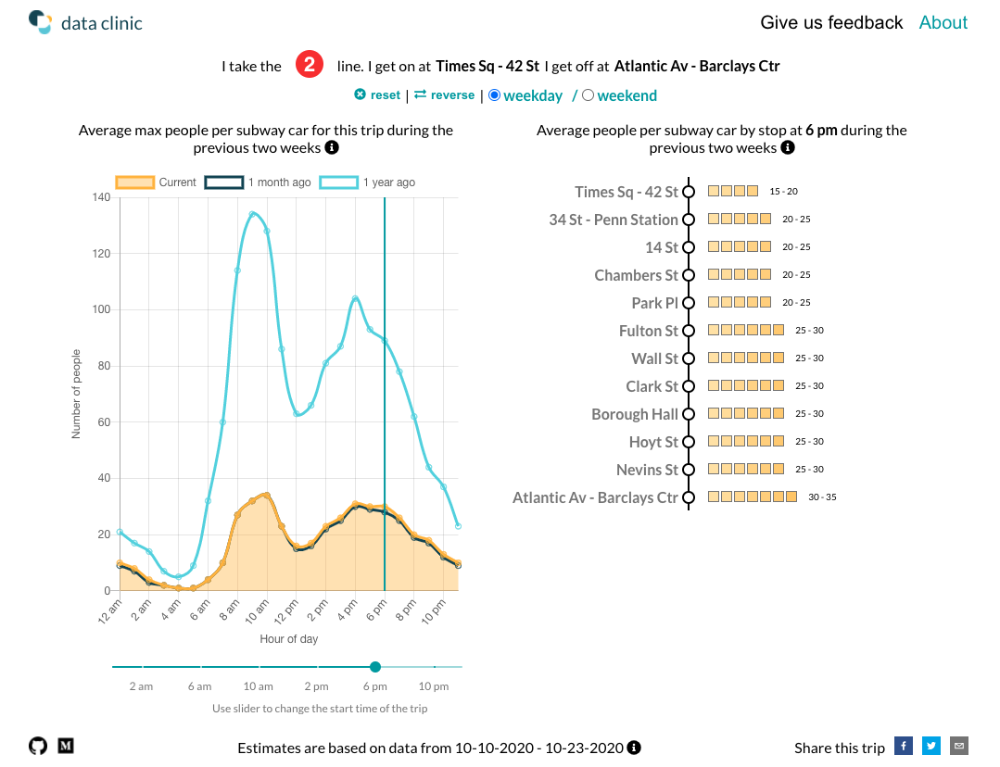

[](https://app.netlify.com/sites/howbusyismytrain/deploys)

<p align="center">
  
</p>

# Subway Crowds

<p align="center">
  
</p>

### Plan your commute better
We built <a href="https://subwaycrowds.tsdataclinic.com">SubwayCrowds</a> to estimate how crowded your subway trip is likely to be.

As the city continues to adjust to the new normal and people begin heading back to work and school, a central question is how will this work given NYC commuters reliance on public transportation. Is it possible to move so many people while maintaining social distancing? To help inform this question, SubwayCrowds is designed to identify for specific trips when subway cars are likely to be most crowded so that individuals might alter their travel time or route.


### Methodology 

<p align="center">
  
</p>


**1. Cleaning Schedule Data**
- Concatenate GTFS data pulled every minute for a given time range
- Drop duplicates (on start date, time, trip_id, station) so we don’t double count the same train in the same station twice, and keep the latest time the data is available for each train reaching each station
- Infer starting time of trip in cases where its missing by identifying the earliest available information on that trip
- Define new unique ID for trips (as trip IDs used in raw data repeat across days)
- For each trip, fill in the starting station if missing (this happens a lot) to be 2 minutes before the first stop on the route. 
- Calculate length of each trip and exclude trips < 25% of max trip length


**2. Cleaning & merging Turnstile Data**
- Aggregate total entries and exits by Station and timestamp, consolidating counts for stations with multiple turnstiles (eg. Times Square, Penn station)
- Exclude rows with wild jumps in counts (negative or >10000 in 4hrs)
- Quadratic interpolation of cumulative counts to every minute
- Correct for interpolation bias around peak and lean hours
  - Set count at 6am to be 10% of the count from 4am-8am
  - Set count at 9am to be 40% of the count from 8am-12pm
- Merge with schedule data
- For each train arrival, calculate total entries and exits since the last train at the station


**3. Trip assignment & heuristics**
- For a given line and direction at station for an hour to approximate which direction a person goes when entering a station we use: 
   - *Entry weight = 1 - cumulative exits along route **after this station** at this hour / total exits along the route **in either direction** at this hour*
   - *Exit weight = 1 - entry weight*
  - Normalize weights as a proportion of all the lines in the station
  - Find service changes in the schedule and impute weights for these as the average for that station (to handle cases like C train running along F line)


**4. Crowding Estimation**
- For the first train of the day (around 5am), we set people waiting at the station to 0 (Stations are meant to be closed between 1 and 5 am, yet we see a few entries in the station between these hours)
- We define entry_exit_ratio as the average daily ratio between overall entries and exits (typically between 1.2 and 1.4) to account for individuals exiting the station through the emergency exits (we use 1.25 currently)
- For each stop, we calculate the following: (initialized to 0)
  - *waiting[t] = waiting[t-1] - train_entries[t-1] + total_entries_since_last_train*
  - *train_entries[t] = waiting[t] **x** entry_weight*
  - *train_exits[t] = min(total_exits_before_next_train **x** entry_exit_ratio **x** exit_weight, crowd[t-1])*
  - *crowd[t] = crowd[t-1] - train_exits[t] + train_entries[t]*
- Aggregate estimates for each hour for each line and station


### Developing 

Thank you developing this tool with us! before you start, do checkout our [Roadmap](Roadmap.md) and [Contributing guidelines](Contributing.md).

To develop the web-app locally, run 

```bash
yarn
yarn start 
```
To set up the python environment, run

```bash
conda config --append channels conda-forge
conda create -n {env_name} --file scripts/requirements.txt

## to have the environment showup as a kernel on jupyter
python -m ipykernel install --user --name {env_name} --display-name "Python ({env_name})"
```

To generate crowd estimates, edit global variables at the top and run

```bash
python scripts/crowding.py
```

### Directory Structure

    SubwayCrowds/
    ├── LICENSE
    ├── README.md               <- The top-level README for developers using this project
    │
    ├── scripts
    │   ├── data                <- Other data used for crowding estimation such as crosswalks, GTFS static schedule, etc.
    │   ├── gcs_utils.py        <- Utility functions for accessing data from Google Cloud Storage bucket 
    │   ├── gtfs.py             <- Processing real-time gtfs data
    │   ├── tunrstile.py        <- Cleaning and interpolating turnstile data
    │   ├── heuristics.py       <- Logic for trip assignment and crowd estimation
    │   ├── crowding.py         <- Pipeline for generating subway crowd estimates
    │   └── Crowding.ipynb      <- Notebook version of crowding.py 
    |
    ├── public                  <- Static files used by the application
    │
    ├── requirements.txt        <- Packages to build the python environment
    │
    ├── src                     <- React front-end application structure
    │   ├── Context             
    │   ├── Hooks               
    │   └── components
           

### Datasets used

The links to the data used to generate crowd estimates are below:

- <a href="https://api.mta.info/#/landing">GTFS Realtime Feed</a>
- <a href="http://web.mta.info/developers/data/nyct/subway/google_transit.zip">GTFS Static Data</a>
- <a href="http://web.mta.info/developers/turnstile.html">Turnstile Usage Data</a>
- <a href="https://github.com/tsdataclinic/mta">Crosswalk to merge GTFS and Turnstile data, Standard stop order, etc. </a>

